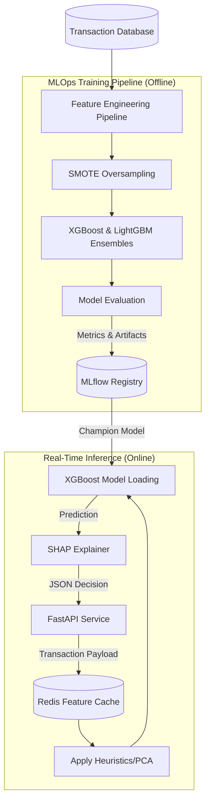

# 🛡️ FraudGuard: System Architecture & Design Trade-offs

This document outlines the ML infrastructure, data pipelines, and architectural decisions powering FraudGuard's production environments.

## System Architecture

## 🧠 Engineering Trade-offs

### 1. XGBoost vs. Deep Learning (LSTMs)
* **Decision**: We actively chose **Gradient Boosted Trees (XGBoost/LightGBM)** over Deep Learning models (like LSTMs or Autoencoders) for fraud detection.
* **Rationale**: Fraud datasets are primarily highly-structured, tabular data (amounts, timestamps, PCA features) rather than unstructured sequences. Tree-based models dominate tabular data performance. Furthermore, XGBoost trains in a fraction of the time and compute resources of a deep neural network.
* **Trade-off**: We lose some ability to automatically learn complex temporal sequences across a user's entire lifetime history, but we gain immense training speed and avoid the hardware costs of GPU clusters.

### 2. SMOTE Oversampling vs. Undersampling
* **Decision**: To handle the extreme 1:200 fraud-to-legitimate transaction imbalance, we utilized **SMOTE** (Synthetic Minority Over-sampling Technique) combined with class weights.
* **Rationale**: Undersampling the majority class (legitimate transactions) would mean throwing away 99% of our valid data behaviors, causing the model to miss subtle changes in normal user patterns.
* **Trade-off**: SMOTE increases the training dataset size significantly, leading to longer training times and higher RAM usage, but it prevents the complete loss of majority-class information.

### 3. Real-Time SHAP vs. Async Explainability
* **Decision**: Local explanations (SHAP values) are computed at inference time.
* **Rationale**: In regulated financial systems (FCRA compliance), analysts need to know *exactly why* a transaction was flagged as fraudulent instantly to resolve customer blocks.
* **Trade-off**: Computing SHAP values adds ~18ms to the P95 latency overhead. While this is acceptable for our <50ms SLA, it prevents ultra-low latency (<5ms) high-frequency trading applications. To mitigate this, SHAP computation is skipped if the prediction score is extremely safe (< 5% risk).
